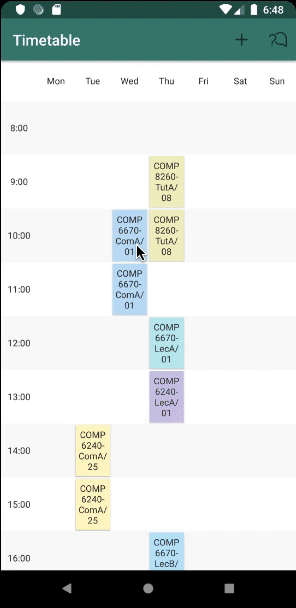
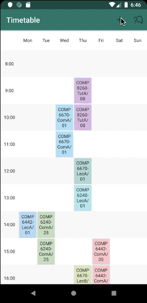
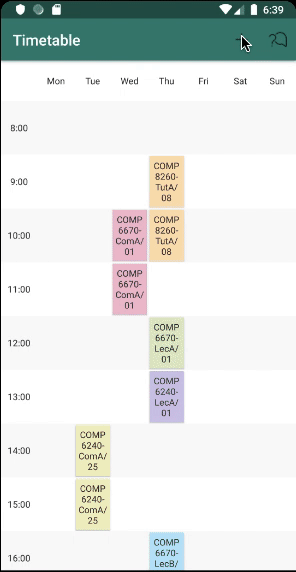
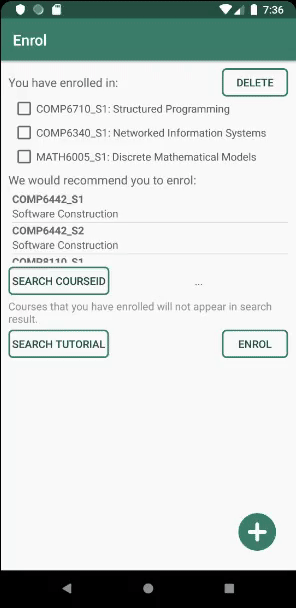

>  This is a repository of the comp2100/6442 group project. We made an Android time-tabling assistant for ANU students.

# App: Pocket Timetable

## Team structure and roles

* <b>Yuqing Zhai (u6865190)</b>: enrol page code, tricky android code, graphics rendering
* <b>Yongchao Lyu (u6874539)</b>: web crawler, main page code, tricky android code, internal storage operation
* <b>Jingwei Wang (u6891978)</b>: interface design and logic implementation for connecting front-end and back-end
* <b>Xiaochan Zhang (u6855326)</b>: add page code, tricky android code, graphics rendering, note-taker

## App Overview

### Home Page
- Display current courses you have enrolled in a weekly calendar.
- Find detailed course information by clicking the course block. 
- If you click the DETAILS button inside the block, you will go directly to the corresponding ANU official course website.

### Enrol Page
- Display all courses that you have enrolled.
- Delete any courses you have enrolled by selecting the course and clicking the delete button.
- Display all recommendation courses for ANU COMP students based on computing specializations.
- Search any courses in ANU database using ANU course code.
- Select corresponding tutorials, and click the enrol button. If there are any conflicts, you will get a red message. Otherwise, you will automatically return to the home page.

### Add Page
- Modify any courses and tutorials in ANU database.
- Add custom courses and tutorials.

## Statement of Originality

I <b>Yuqing Zhai (u6865190)</b> declare that everything I have submitted in this assignment is entirely my own work.

I <b>Yongchao Lyu (u6874539)</b> declare that everything I have submitted in this assignment is entirely my own work.

I <b>Jingwei Wang (u6891978)</b> declare that everything I have submitted in this assignment is entirely my own work.

I <b>Xiaochan Zhang (u6855326)</b> declare that everything I have submitted in this assignment is entirely my own work.

### Inspiration

- The layout style of the timetable is inspired by the design from [GitHub - Timetable View](https://github.com/tlaabs/TimetableView)
- The custom adapter for SearchView and ListView is inspired by the answer from [Stackoverflow Answer from Haresh Chhelana](https://stackoverflow.com/a/23422665/12130431)
- The courseDetailAdapter for list view in AddActivity at first could not solve the bug that if you 
choose some value in a spinner and scroll the list view the value in spinner will disappear, the way to solve this bug is inspired by Lars Voge‘s [Using lists in Android wth ListView - Tutorial](https://www.vogella.com/tutorials/AndroidListView/article.html)

### Code

All the codes we submitted in this assignment are developed by ourselves.

### Assets

The original data of available courses are crawled from the [ANU timetable website](http://timetabling.anu.edu.au/sws2019/)

## Design Summary

### Functional Design:
- <b>Data Source</b>: Use a self-developed crawler to get original pages from ANU timetable.
- <b>Data Analysis</b>: Use a Python-based program to parse the original pages.
- <b>Data Storage</b>: Compare SQLite with file storage, such as CSV or JSON file types.
- <b>Feature classification</b>: List all features need to do and separate them into specific activities.
- <b>Relationship of classes</b>: Draw a UML graph to display the relationship between classes.

### Style Design:
- <b>Overall Style</b>: Decide the overall colour, font, and activity type of application.
- <b>Specific Pages</b>: Brainstorm for each page about their layout, display pattern, and components to be utilised.
- <b>Usage Process</b>: Discuss how to make the usage process more smooth and convenient for the user.

## Testing Summary

### Local Unit Tests:
- <b>MyAdapter Test</b>: Test the custom adapter for ListView.
- <b>Utility Methods Test</b>: Test common methods defined in the Utility class.

### Instrumented Tests:
- <b>File Operator Test</b>: Test migrating files from res/raw to internal storage, read and write files located at either position.
- <b>User Courses Operation</b>: Test Creating, Retrieving, Updating, Deleting (CRUD) of the file of user courses.
- <b>Available Courses Operation</b>: Test CRUD of the file of all available courses.
- <b>Compatibility Functions Test</b>: Test the functions that check whether a course conflicts with other courses.
- <b>Enrol Activity Test</b>: Test the EnrolActivity for the enrol page whether successfully display.
- <b>Guide Activity Test</b>: Test the GuideActivity for the guide whether successfully display.
